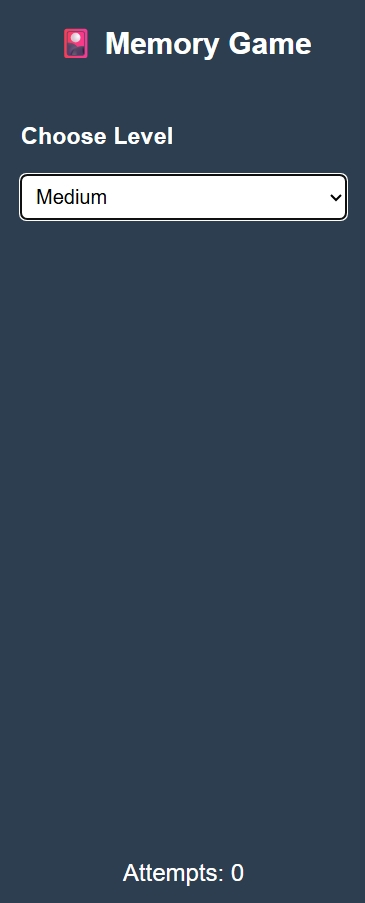
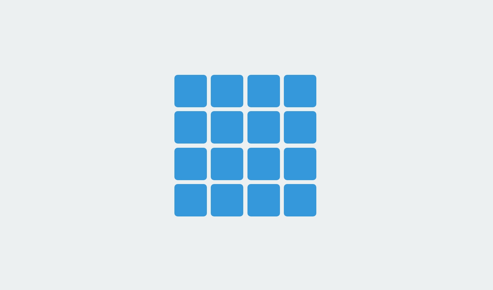

# 🎴 Memory Game

A fun and simple **Memory Matching Game** built with **HTML**, **CSS**, and **jQuery**.  
Test your memory by matching pairs of fruit emojis in as few attempts as possible!

---

## 📸 Screenshots

| Sidebar                               | Gameplay                                |
| ------------------------------------- | --------------------------------------- |
|  |  |

---

## 🚀 Live Demo

> Once deployed on **GitHub Pages**, the link will be:  
> 🔗 [https://Abdullahh74.github.io/Memory-Game](https://Abdullahh74.github.io/Memory-Game)

---

## 🧩 Game Levels

The game includes 4 different difficulty levels:

| Level           | Cards                   | Grid  |
| --------------- | ----------------------- | ----- |
| 🟢 **Easy**     | 4 cards                 | 2 × 2 |
| 🟡 **Medium**   | 16 cards                | 4 × 4 |
| 🔴 **Hard**     | 36 cards                | 6 × 6 |
| 🟣 **Advanced** | 36 cards (more symbols) | 6 × 6 |

---

## 💡 How to Play

1. Choose a level from the sidebar.
2. Click on two cards to flip them.
3. If both cards match, they stay flipped.
4. Try to finish the game with the **fewest attempts** possible!
5. Change levels anytime to start a new challenge.

---

## 🛠️ Built With

- 🧱 **HTML5** — Structure of the game.
- 🎨 **CSS3** — Styling and layout design.
- ⚙️ **jQuery (JavaScript)** — Game logic and interactivity.

---

## 📁 Project Structure

<pre>
📂 Memory-Game
┣ 📜 index.html
┣ 📜 style.css
┣ 📜 main.js
┣ 📜 jquery-3.7.1.js
┣ 📷 sidebar.png
┗ 📷 gameplay.png
</pre>

## 🧠 Features

✅ Clean and modern UI  
✅ Four difficulty levels  
✅ Real-time move counter  
✅ Auto-reset when level changes  
✅ Simple and easy to customize code
